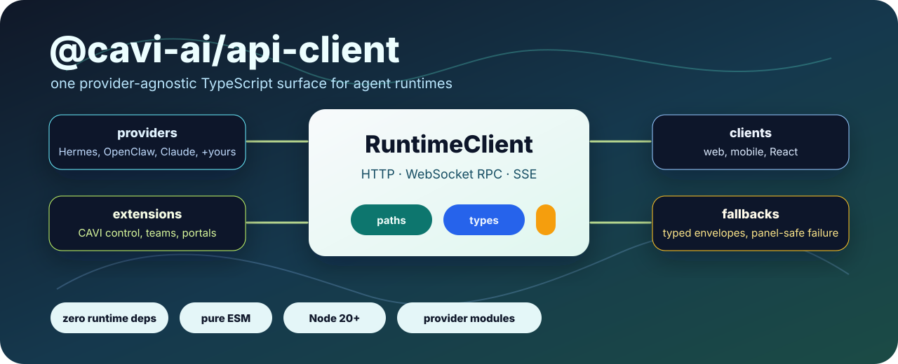

<h1 align="center">
  
</h1>

<p align="center">
  <strong>One TypeScript client for every agent runtime. 🛰️</strong><br>
  Talk to Hermes, OpenClaw, Claude, and Codex through a single <code>RuntimeClient</code> contract — HTTP, WebSocket RPC, SSE streaming, media, wiki, team routing, React hooks, and typed data adapters, all behind one package boundary. <strong>Swap providers, not your code.</strong>
</p>

<p align="center">
  🤖 <strong>Now with first-class <a href="#-claude-managed-agents-beta">Claude Managed Agents (beta)</a></strong> — Anthropic's stateful, server-run agents (sessions · environments · SSE steering), wired to the same contract. <strong>The easy way in.</strong>
</p>

[](LICENSE)
[](https://github.com/cavi-ai/cavi-api-client/actions/workflows/ci.yml)
[](#-claude-managed-agents-beta)


<p align="center">
  
</p>

```sh
npm install @cavi-ai/api-client
```

## Contents

- [Why This Package Exists](#why-this-package-exists)
- [Runtime](#runtime)
- [Exports](#exports)
- [Quick Start](#quick-start)
- [🤖 Claude Managed Agents (Beta)](#-claude-managed-agents-beta)
- [Core Concepts](#core-concepts)
  - [One Client Shape](#one-client-shape)
  - [Providers](#providers)
  - [Credential Schemes](#credential-schemes)
  - [Typed Errors](#typed-errors)
  - [Usage & Cost](#usage--cost)
  - [Graceful Degradation](#graceful-degradation)
  - [Route Mirrors](#route-mirrors)
  - [Team Manifest](#team-manifest)
- [Common Surfaces](#common-surfaces)
  - [HTTP](#http)
  - [WebSocket RPC](#websocket-rpc)
  - [Run Event Streams](#run-event-streams)
  - [Media And Wiki](#media-and-wiki)
  - [React](#react)
  - [CAVI Extension Adapters](#cavi-extension-adapters)
- [Secure Credential Handling](#secure-credential-handling)
- [Architecture](#architecture)
- [Development](#development)
- [Contributing](#contributing)
- [Code of Conduct](#code-of-conduct)
- [Security](#security)
- [License](#license)

## Why This Package Exists

Building on top of agent runtimes means writing the same plumbing over and over:
authenticated requests, WebSocket RPC, run-event streams, capability snapshots,
route contracts, typed errors, and fallback behavior for when the backend
inevitably hiccups. `@cavi-ai/api-client` keeps all of it in one reusable,
provider-agnostic package — so your app code focuses on the *workflow*, not the
transport.

### 🤔 This package is for you if…

1. 🛰️ **You run multiple gateways and runtimes** across different providers, and you'd rather have one client than a pile of one-off integrations.
2. 🎛️ **You're building interactive, agentic UI** — live runs, streaming events, capability-aware panels — and don't want to rebuild the transport layer every single project.
3. ⏰ **You don't love the *timing* of upstream bugs** (always mid-demo, never a quiet Tuesday) and want your UI to shrug them off instead of faceplanting.
4. 🤷 **You've made peace with the one universal constant:** humans *and* agents ship mistakes. So here, degradation is a **contract** — a backend gap returns typed fallback data with a structured `contractGap`, not a white screen of death.
5. 🔀 **You need to switch providers without a rewrite** — Hermes today, OpenClaw tomorrow, Claude on Friday — all behind the exact same calls.
6. 📐 **You want stable, schema-correct endpoints** that hand back the *same shape* no matter which provider answered, so per-provider `if/else` spaghetti never leaks into your components.
7. 🎉 **You want in on a genuinely fun open-source project** (MIT, strict-typed to the teeth, conformance-tested — and yes, PRs are actually welcome).
8. 🐶🐱 **You like puppies and kittens.** …alright, we're reaching. But you're still reading, so maybe we're onto something. 😄

### 🧩 How it holds together

The core is provider-agnostic. Every provider implements one universal
`RuntimeClient` contract (capabilities · runs · streaming); gateway-style
providers (Hermes, OpenClaw) extend it with `GatewayClient` (teams, kanban,
workspace, operator), while non-gateway providers (Claude / Anthropic) implement
the runtime tier only. Provider modules customize only what's *actually*
different — endpoint maps, headers, auth scheme, method transport. The shared
transports, error handling, stream parsing, and trace behavior stay in one
place, and an executable conformance kit keeps every provider honest.

## Runtime

- Pure TypeScript ESM with generated `.d.ts` files.
- Node.js `>=20`, or any modern runtime with `fetch` and `WebSocket`.
- Zero runtime dependencies.
- React is an optional peer dependency used only by
  `@cavi-ai/api-client/frameworks/react`.
- `fetchImpl` can be supplied anywhere a runtime needs an explicit fetch
  implementation.

## Exports

The **root export** is a curated stable API: the unified client + provider
registry, the universal `RuntimeClient`/`GatewayClient` types, errors and guards,
the graceful-degradation envelope, the auth-seam credential helpers, the team
manifest interface + resolver, and the run-stream contract. Everything else lives
behind a **subpath** so consumers import only the slice they need:

- `@cavi-ai/api-client/core/http` — `BaseHttpApiClient`, raw/JSON clients, redaction
- `@cavi-ai/api-client/core/data`
- `@cavi-ai/api-client/core/errors`
- `@cavi-ai/api-client/core/runtime` — `RuntimeClient`, run-stream contract
- `@cavi-ai/api-client/core/sse`
- `@cavi-ai/api-client/core/ws`
- `@cavi-ai/api-client/core/gateway` — gateway resource clients (media, wiki, agent-config, jobs)
- `@cavi-ai/api-client/core/env`
- `@cavi-ai/api-client/contracts`
- `@cavi-ai/api-client/extensions/cavi` — `CaviControlApiClient`, registry, portal, library, adapters
- `@cavi-ai/api-client/providers/hermes`
- `@cavi-ai/api-client/providers/openclaw`
- `@cavi-ai/api-client/providers/claude` — Claude (Anthropic): the stateless
  Messages-API runtime provider **and** the [Managed Agents (beta)](#-claude-managed-agents-beta) surface
- `@cavi-ai/api-client/providers/codex` — Codex-flavored OpenAI Responses
  runtime provider (`gpt-5-codex`, background runs, polling, cancellation,
  SSE streaming)
- `@cavi-ai/api-client/frameworks/react`

> **Upgrading from a flat-import version?** Provider modules, the CAVI extension,
> and low-level primitives moved off the root entry to their subpaths. See
> [MIGRATION.md](MIGRATION.md) for the import map.

## Quick Start

```ts
import { createGatewayApiClient } from "@cavi-ai/api-client";

const gateway = createGatewayApiClient({
  baseUrl: process.env.GATEWAY_API_BASE_URL!,
  auth: {
    bearerToken: process.env.GATEWAY_API_AUTH_TOKEN,
    clientId: "dashboard",
  },
});

const run = await gateway.startRun({
  input: "Summarize the current workspace state.",
  session_id: "dashboard",
});
// run.run_id / run.status are your handle for polling, streaming, or UI state.
// Failures are typed — see Typed Errors below for how to branch on them.
```

## 🤖 Claude Managed Agents (Beta)

Anthropic ships a second, far less famous way to run Claude: **Managed Agents**
(beta). Instead of you running the agent loop, Anthropic does — a *persisted,
versioned agent config* spawns *stateful sessions*, each in its own
*containerized environment* where Claude executes tools (bash, file ops, code),
streaming every step over SSE. Skills, MCP servers, file mounts, multiagent
threads, and rubric-graded outcomes are all part of it. Most people don't even
know it exists.

This package is meant to be **the easy on-ramp**. It's runtime-only and additive:
the same `RuntimeClient` you already use, one extra import, no app rewrite, and
**nothing about your existing setup has to change**. Already have a harness you
like? Keep it — try Managed Agents alongside it and see which fits which job.

```ts
import {
  ClaudeManagedAgentClient,
  driveManagedAgentSession,
} from "@cavi-ai/api-client/providers/claude";

const claude = new ClaudeManagedAgentClient({
  apiKey: process.env.ANTHROPIC_API_KEY!, // or `authToken` for an OAuth bearer
});

// Agents + environments are persisted — create them once, reference them by id.
const agent = await claude.createAgent({
  name: "researcher",
  model: "claude-opus-4-8",
  system: "You are a meticulous research assistant.",
});
const env = await claude.createEnvironment({ name: "research-env" });

// A session is one stateful run against that agent in that environment.
const session = await claude.createSession({
  agentId: agent.id,
  environmentId: env.id,
});
await claude.sendMessage(session.id, { input: "Summarize today's commits." });

// Tail the SSE stream, answer tool confirmations + custom tools, survive drops.
await driveManagedAgentSession(claude, session.id, {
  onMessage: (text) => appendAgentText(text),
  onToolConfirmation: () => ({ result: "allow" }), // omit → deny
  onComplete: () => markRunComplete(),
});
```

Everything is exported from `@cavi-ai/api-client/providers/claude` and verified
against the live beta API (`managed-agents-2026-04-01`):

- **Sessions & steering** — `createSession`, `sendMessage`/`sendEvents`,
  `interruptSession`, `confirmTool`, `respondCustomTool`, `openEventStream`,
  and `driveManagedAgentSession` (a deadlock-safe stream driver with lossless
  reconnect and dedupe).
- **Agents & environments** — persisted, versioned configs and per-session
  containers (`createAgent`, `updateAgent`, `createEnvironment`).
- **Typed events** — `parseSessionEvent` + a discriminated
  `ManagedAgentSessionEvent` union (messages, tool calls, status, errors,
  outcomes, threads).
- **Outcomes** — `defineOutcome` for rubric-graded session loops.
- **Multiagent threads** — `listThreads`, `openThreadEventStream`, and friends.
- **Memory stores** — full CRUD over stores, memories, and memory versions.
- **Vaults & MCP credentials** — vault/credential CRUD plus
  `validateMcpOauthCredential` for `static_bearer` and `mcp_oauth` auth.
- **Teams** — `buildManagedAgentTeamsPlan` maps a `TeamManifest` to a
  coordinator + roster.
- **Webhook verification** — `verifyManagedAgentWebhook` implements the
  Standard Webhooks signing scheme via Web Crypto (verified against the scheme;
  live delivery is out of scope for this release).
- **Self-hosted environments** — `getWorkQueueStats` / `stopWork` observe and
  control the work queue (queue monitoring only — the tool-executing worker
  stays with the host).

> The stateless Claude Messages-API client (`ClaudeApiClient`, below) is
> unchanged — Managed Agents is an additive sibling under the same subpath.

## Core Concepts

### One Client Shape

Every provider implements the universal **`RuntimeClient`** contract — capability
profile, runs (`startRun`/optional `getRun`/`cancelRun`), and optional
`streamRun`. **`GatewayClient`** *extends* `RuntimeClient` for gateway-style
backends, adding teams, kanban, workspace, and operator surfaces. `GatewayApiClient`
implements both tiers; a non-gateway provider (e.g. Claude) implements
`RuntimeClient` only and declares its capability profile so unsupported surfaces
fail with a typed `EndpointNotFound` rather than a hard crash.

```ts
import {
  GatewayApiClient,
  createGatewayApiClient,
  createGatewayProviderRegistry,
} from "@cavi-ai/api-client";
import type { GatewayProviderModule } from "@cavi-ai/api-client/core/gateway";

const provider: GatewayProviderModule = {
  kind: "acme",
  aliases: ["acme-gateway"],
  createApiClient: (options) => new GatewayApiClient(options, "acme-api"),
};

const registry = createGatewayProviderRegistry({ modules: [provider] });
const client = createGatewayApiClient(config.gateway, {
  provider: "acme-gateway",
  registry,
});
```

Provider modules should reuse core transports. They should not fork JSON request
handling, RPC flow, SSE parsing, trace redaction, or error normalization.

### Providers

Built-in providers register through the same registry; `createRuntimeProviderRegistry`
accepts runtime-only modules (no gateway factories required):

```ts
import { createRuntimeProviderRegistry } from "@cavi-ai/api-client";
import { HERMES_PROVIDER_MODULE } from "@cavi-ai/api-client/providers/hermes";
import { OPENCLAW_PROVIDER_MODULE } from "@cavi-ai/api-client/providers/openclaw";
import { createClaudeProviderModule } from "@cavi-ai/api-client/providers/claude";
import { createCodexProviderModule } from "@cavi-ai/api-client/providers/codex";

const registry = createRuntimeProviderRegistry({
  modules: [
    HERMES_PROVIDER_MODULE,
    OPENCLAW_PROVIDER_MODULE,
    createClaudeProviderModule({ apiKey: process.env.ANTHROPIC_API_KEY! }),
    createCodexProviderModule({ apiKey: process.env.OPENAI_API_KEY! }),
  ],
});

registry.resolveProvider("claude-sdk"); // -> the Claude module
registry.resolveProvider("codex"); // -> the Codex Responses module
```

The **Claude (Anthropic) provider** is runtime-only — it maps `startRun` to
`POST /v1/messages` and streams the Messages SSE into the canonical
`RunStreamEvent`:

```ts
import { ClaudeApiClient } from "@cavi-ai/api-client/providers/claude";

const claude = new ClaudeApiClient({ apiKey: process.env.ANTHROPIC_API_KEY! });

const run = await claude.startRun({
  input: "Summarize the workspace state.",
  model: "claude-opus-4-8",
  instructions: "Be concise.",
});

await claude.streamRun(
  { input: "Stream a haiku.", model: "claude-opus-4-8" },
  {
    onEvent: (event) => appendRunEvent(event), // canonical RunStreamEvent
    onComplete: () => markRunComplete(),
  },
);
```

For Claude's **stateful, server-run** mode — persisted agents, containerized
sessions, and SSE steering — see [🤖 Claude Managed Agents (Beta)](#-claude-managed-agents-beta)
above; it ships from the same `@cavi-ai/api-client/providers/claude` subpath.

The **Codex provider** is also runtime-only. It uses the OpenAI Responses API
with `gpt-5-codex` by default, starts background responses so UIs can poll or
cancel by response id, and streams Responses SSE into canonical
`RunStreamEvent`s:

```ts
import { CodexApiClient } from "@cavi-ai/api-client/providers/codex";

const codex = new CodexApiClient({ apiKey: process.env.OPENAI_API_KEY! });

const run = await codex.startRun({
  input: "Review this component plan for risks.",
  instructions: "Return concise engineering guidance.",
});

await codex.streamRun(
  { input: "Draft the implementation checklist." },
  { onEvent: (event) => appendRunEvent(event) },
);
```

Keep OpenAI API keys backend-owned. Browser and mobile apps should call your
backend, which can instantiate `CodexApiClient`; they should not embed raw
OpenAI credentials.

Writing your own provider? Point the shared **conformance kit**
(`src/__tests__/support/runtime-conformance.ts`) at your client and it must pass
the same contract every built-in provider does.

### Credential Schemes

A provider declares its auth scheme through `auth.resolveHeaders` instead of the
core hardcoding a bearer token. Ready-made resolvers cover the common cases:

```ts
import { bearerCredentials, apiKeyCredentials } from "@cavi-ai/api-client";

// Gateway bearer token (the default if you pass auth.bearerToken)
const gatewayAuth = { resolveHeaders: bearerCredentials(process.env.GATEWAY_API_AUTH_TOKEN) };

// Anthropic api-key + version header
const anthropicAuth = {
  resolveHeaders: apiKeyCredentials(process.env.ANTHROPIC_API_KEY!, {
    header: "x-api-key",
    extra: { "anthropic-version": "2023-06-01" },
  }),
};
```

A provider can also report a protocol version; `assertProtocolVersion(caps, expected)`
turns a backend version mismatch into a typed `ProtocolMismatch` error instead of
a confusing downstream failure.

### Typed Errors

Every failure is one of the package's typed classes — `HttpApiError` (non-2xx,
network failure, abort, invalid JSON), `GatewayHttpError` (gateway HTTP detail),
`GatewayRpcError` (WebSocket RPC rejection), or `ApiClientError` (synthesized
config/validation/transport). Branch on a guard, never on `error.message`, and
never re-wrap a failure in a generic `Error`.

```ts
import {
  getErrorStatus,
  isAbortError,
  isAuthError,
  isHttpApiError,
} from "@cavi-ai/api-client";

try {
  await cavi.getOperatorSnapshot();
} catch (error) {
  if (isAbortError(error)) return;          // request was cancelled
  if (isAuthError(error)) return signOut(); // 401/403 across HTTP error classes
  if (getErrorStatus(error) === 404) return markUnavailable();
  if (isHttpApiError(error)) {
    reportError({ status: error.status, path: error.path, body: error.body });
  }
  throw error; // unknown shape: never swallow it
}
```

`isAuthError` covers both `HttpApiError` and `GatewayHttpError`; `getErrorStatus`
returns the numeric HTTP status or `undefined`. Lower-level helpers
(`getErrorMessage`, `serializeError`, `toError`, and the `ApiClientErrorType` /
`ApiClientErrorCode` enums) remain available from `core/errors`.

> **Antipattern:**
>
> ```ts
> // ❌ Message matching breaks on rewording/localization and swallows real failures.
> catch (e: any) {
>   if (e.message.includes("401")) signOut();
>   else console.log("request failed");
> }
> // ❌ Re-wrapping erases status, path, body, and the cause chain.
> throw new Error("snapshot failed");
> ```

### Usage & Cost

Every provider populates a provider-agnostic `tokens` field on the run status, so
you read token usage the same way regardless of backend:

```ts
const run = await client.startRun({ input: "Summarize.", model: "claude-opus-4-8" });
run.tokens?.inputTokens;   // normalized across Claude / Codex / gateways
run.tokens?.outputTokens;
run.tokens?.cacheReadTokens;
run.tokens?.raw;           // lossless provider-native counts
```

The streamed `run.completed` event carries the same `usage: RuntimeUsage` when the
provider reports it. The legacy `run.usage` (raw provider keys) is **deprecated** but
still populated.

Cost is **pluggable** — the package ships no price table. Supply your own
per-million-token prices:

```ts
import { estimateUsageCost } from "@cavi-ai/api-client";

const usd = estimateUsageCost(run.tokens ?? {}, {
  inputPerMTok: 3,
  outputPerMTok: 15,
  cacheReadPerMTok: 0.3,
});
```

### Graceful Degradation

Gateway loaders can return a typed `DataEnvelope<T>`:

```ts
type DataEnvelope<T> = {
  data: T;
  source: "gateway" | "mock";
  fetchedAt: number;
  contractGaps: ContractGap[];
};
```

`withFallback` and `withMutationResult` keep expected backend gaps visible
without crashing an entire dashboard. Auth failures and unknown errors still
throw.

### Route Mirrors

OpenClaw, Caviclaw plugins, and gateway hosts own their runtime API routes.
This package only mirrors those routes so client code has one import path and
does not drift into hand-built strings. Mirrored route literals belong in:

- Global contracts: `src/contracts/paths.ts` and `src/contracts/surfaces.ts`.
- CAVI extension contracts:
  `src/extensions/cavi/contracts/paths.ts` and
  `src/extensions/cavi/contracts/surfaces.ts`.
- OpenClaw provider mirrors:
  `src/providers/openclaw/manifest.ts` and
  `src/providers/openclaw/workboard.ts`.

Consumers should use exported constants and resolvers such as `resolvePath` and
`appendHttpQuery` (root), and `resolveCaviPath` plus the CAVI contract helpers
(`@cavi-ai/api-client/extensions/cavi`). Avoid assembling paths by hand in
clients, components, or adapters. New or changed paths must come from the
upstream gateway/plugin contract first.

### Team Manifest

The team manifest is an **interface, not data the package owns**. The package
ships the manifest *shape* (types + normalization + lookup validation), a
`TeamRouteResolver`, and a `TeamManifestSource` "bring-your-own-manifest" seam —
the host supplies the actual team/member/workspace/action data at runtime. CAVI
identity specifics live in `identity.metadata`, keeping the contract agnostic.

```ts
import {
  createStaticManifestSource,
  createTeamRouteResolver,
  normalizeTeamManifest,
  resolveTeamWorkspaceApiPath,
  type TeamManifest,
} from "@cavi-ai/api-client";

const source = createStaticManifestSource({
  version: 1,
  teams: [
    {
      id: "research",
      identity: { displayName: "Research", slug: "research", code: "RND" },
      workspace: {
        rootPath: "/teams/research/workspace",
        paths: ["reports", { key: "media.images", path: "media/images" }],
      },
      members: [{ id: "analyst", capabilities: ["research.read"] }],
    },
  ],
} satisfies TeamManifest);

const manifest = await source.getManifest();
const resolver = createTeamRouteResolver();
const path = resolver.resolveWorkspaceApiPath(manifest, "research", "media.images", {
  memberId: "analyst",
});
```

> The CAVI team registry (which overlays operator-dispatch data on top of the
> generic manifest) lives in `@cavi-ai/api-client/extensions/cavi` —
> `createTeamRegistry`, `configureTeamRegistryConfig`, `TEAM_REGISTRY_CONFIG`.

See [docs/team-manifest.md](docs/team-manifest.md) and
[docs/team-manifest.consumer.template.ts](docs/team-manifest.consumer.template.ts)
for consumer-owned manifest examples.

## Common Surfaces

### HTTP

```ts
import {
  CaviControlApiClient,
  resolveHttpApiConfigFromEnv,
} from "@cavi-ai/api-client/extensions/cavi";

const config = resolveHttpApiConfigFromEnv(process.env);
const cavi = new CaviControlApiClient({
  baseUrl: config.cavi.baseUrl,
  auth: {
    bearerToken: config.cavi.authToken,
    clientId: config.cavi.clientId,
  },
});
```

Canonical environment keys:

- `CAVI_API_BASE_URL`, `CAVI_API_AUTH_TOKEN`, `CAVI_API_CLIENT_ID`
- `GATEWAY_API_BASE_URL`, `GATEWAY_API_AUTH_TOKEN`, `GATEWAY_API_CLIENT_ID`
- `LIBRARY_API_BASE_URL`, `LIBRARY_API_AUTH_TOKEN`, `LIBRARY_API_CLIENT_ID`

Alias keys for common web and mobile app runtimes are supported by default.
Pass `{ includeAliases: false }` to disable aliases.

### WebSocket RPC

```ts
import { createGatewayWebSocketClient } from "@cavi-ai/api-client";

const ws = createGatewayWebSocketClient(target.wsUrl, authToken, {
  clientId: "dashboard",
  requestedScopes: ["operator.read"],
});

await ws.connect();
const sessions = await ws.request<{ sessions: unknown[] }>("sessions.list", {
  limit: 20,
});
```

### Run Event Streams

```ts
import { createGatewaySseRunEventProvider } from "@cavi-ai/api-client";

const stream = createGatewaySseRunEventProvider({
  httpBase: config.gateway.baseUrl,
  authToken: config.gateway.authToken,
  clientId: config.gateway.clientId,
  sessionKey: "dashboard",
});

// Keep the subscription handle so you can `subscription.dispose()` on unmount.
const subscription = await stream.subscribe(
  { runId: "run-123" },
  {
    onEvent: (event) => appendRunEvent(event),
    onError: (error) => reportError(error),
    onComplete: () => markRunComplete(),
  },
);
```

### Media And Wiki

```ts
import {
  createGatewayMediaClient,
  createGatewayWikiClient,
} from "@cavi-ai/api-client";

const media = createGatewayMediaClient({ baseUrl, auth });
const image = await media.generateImage({
  input: "diagram of a workflow",
  format: "png",
});

const wiki = createGatewayWikiClient({ baseUrl, auth });
const page = await wiki.readWikiPage("default", "index.qmd");
```

### React

```tsx
import {
  GatewayClientProvider,
  useGatewayClientContext,
} from "@cavi-ai/api-client/frameworks/react";

function App() {
  return (
    <GatewayClientProvider
      gatewayBaseUrl={gatewayBaseUrl}
      authToken={authToken}
      clientId="portal"
      autoReconnect
    >
      <Panel />
    </GatewayClientProvider>
  );
}

function Panel() {
  const { client, state, connect } = useGatewayClientContext();
  return <button onClick={() => void connect()}>{state}</button>;
}
```

### CAVI Extension Adapters

`extensions/cavi` contains product-shaped composition over the generic core.
The extension mirrors CAVI-specific DTOs, adapters, fallback providers, and
plugin route contracts while still using shared transports and error handling.

```ts
import { createCaviControlAdapters } from "@cavi-ai/api-client/extensions/cavi";

const adapters = createCaviControlAdapters({
  gatewayBaseUrl,
  apiBaseUrl,
  authToken,
  client: gatewayRpcClient,
  fallbackMode: "empty",
});

const overview = await adapters.loadOverview();
```

## Secure Credential Handling

The client never persists credentials — applications pass `auth.bearerToken` and
own storage. On devices that means the OS keychain/keystore or an encrypted
store, **never** plaintext `AsyncStorage` or `localStorage`. Keep the client
storage-agnostic behind one interface:

```ts
export interface TokenStore {
  get(): Promise<string | null>;
  set(token: string): Promise<void>;
  clear(): Promise<void>;
}
```

`expo-secure-store` (Keychain / Keystore) and `react-native-mmkv` (encrypted
instance) are drop-in backends:

```ts
import * as SecureStore from "expo-secure-store";
import { MMKV } from "react-native-mmkv";

const KEY = "cavi.gateway.bearer";

export const secureStoreTokens: TokenStore = {
  get: () => SecureStore.getItemAsync(KEY),
  set: (token) =>
    SecureStore.setItemAsync(KEY, token, {
      keychainAccessible: SecureStore.WHEN_UNLOCKED_THIS_DEVICE_ONLY,
    }),
  clear: () => SecureStore.deleteItemAsync(KEY),
};

const storage = new MMKV({ id: "cavi-auth", encryptionKey: deviceEncryptionKey });
export const mmkvTokens: TokenStore = {
  get: async () => storage.getString(KEY) ?? null,
  set: async (token) => storage.set(KEY, token),
  clear: async () => storage.delete(KEY),
};
```

Build the client from the stored token and refresh only on a typed auth
failure — `isAuthError` covers `HttpApiError` and `GatewayHttpError`, so you
never re-check `.status` by hand:

```ts
import { isAuthError } from "@cavi-ai/api-client";
import { CaviControlApiClient } from "@cavi-ai/api-client/extensions/cavi";

async function withFreshAuth<T>(
  tokens: TokenStore,
  call: (client: CaviControlApiClient) => Promise<T>,
): Promise<T> {
  const build = async () =>
    new CaviControlApiClient({
      baseUrl: config.cavi.baseUrl,
      auth: { bearerToken: (await tokens.get()) ?? undefined, clientId: "cavi-mobile" },
    });
  try {
    return await call(await build());
  } catch (error) {
    if (!isAuthError(error)) throw error; // only refresh on 401/403
    await tokens.set(await refreshAccessToken());
    return call(await build());
  }
}
```

Avoid logging raw request headers, auth tokens, or full error bodies; trace
helpers redact sensitive values before emitting previews.

> **Antipattern:**
>
> ```ts
> // ❌ Plaintext token on disk — readable by backups, other apps, rooted devices.
> await AsyncStorage.setItem("token", token);
> localStorage.setItem("token", token);
> ```

## Architecture

See [ARCHITECTURE.md](ARCHITECTURE.md) for the layer map, provider boundary,
route mirror rules, and extension/plugin split.

## Development

```sh
pnpm install
pnpm test
pnpm run build
pnpm run lint:md
pnpm run verify
```

Strict TypeScript is the lint gate. Relative source imports use `.js`
extensions. Tests live under `src/__tests__/**`.

The hardening tests in
[`src/__tests__/package-hardening.test.ts`](src/__tests__/package-hardening.test.ts)
enforce package boundaries, path ownership, forbidden imports, and output shape.
Update them only when the package boundary intentionally changes.

## Contributing

See [CONTRIBUTING.md](CONTRIBUTING.md) for workflow, provider-author guidance,
and boundary rules.

## Code of Conduct

Participation in this project is covered by
[CODE_OF_CONDUCT.md](CODE_OF_CONDUCT.md).

## Security

See [SECURITY.md](SECURITY.md) for vulnerability reporting.

## License

[MIT](LICENSE)
